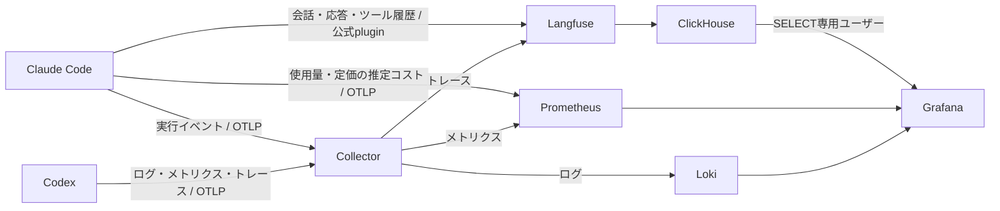

# ローカル Agent Observability

[chlorochrule/dotfiles](https://github.com/chlorochrule/dotfiles)の構成をベースに、
WSL / Docker Desktopで動かすLangfuse・Grafana・Prometheus。
参考と同じTerraformによる初期化とダッシュボードを使い、Codex用にCollector・Lokiを追加している。



## 起動

Docker Engine / Docker Desktop（Compose v2）、Terraform 1.5以上、Python 3.11以上、
`uv`、ログイン済みの`claude` / `codex`、`herdr`が必要。
WSLから `docker info` が成功することを確認する。

```sh
cd ~/dotfiles
python3 scripts/observability.py up
```

一度の実行で、ランダムな認証情報の生成、Compose起動、Langfuseのユーザー・プロジェクト作成、
Grafanaのデータソース・ダッシュボード登録、エージェントの設定を行う。
Langfuseプラグインは公式マーケットプレイスを登録し、生成したAPIキーをClaude Codeの設定機構に渡す。
秘密キーをコマンドの出力やGitに保存しない。Claude Codeの既存設定・Herdrのフックは保持する。

新しいClaude Code / Codexセッションから収集が始まる。過去の履歴は取り込まない。
Herdr内で通常どおり `claude` / `codex` を実行できる。

| サービス | URL | 用途 |
| --- | --- | --- |
| Langfuse | http://localhost:3000 | 会話・モデル応答・ツール呼び出しの履歴 |
| Grafana | http://localhost:3001 | Usage、Agent、Cost、Latency、実行ログ |
| Prometheus | http://localhost:9095 | メトリクスの検索 |
| Collector | http://localhost:13133 | Collectorのヘルスチェック |

ログイン情報は自分のターミナルで次のコマンドを実行して確認する。

```sh
python3 scripts/observability.py credentials
```

## 運用

```sh
python3 scripts/observability.py status
python3 scripts/observability.py down          # 停止。データと鍵は残す
python3 scripts/observability.py up            # 再起動・設定を再適用
python3 scripts/observability.py up --skip-connect  # 基盤のみ
python3 scripts/observability.py connect       # 起動済み基盤にagentを接続
python3 scripts/observability-smoke.py         # 合成ログ・メトリクス・トレースで経路を確認
```

データはDockerの名前付きボリューム、生成した認証情報は `services/*/.env` と
`terraform/local/terraform.tfstate` に保存する。これらはGit管理外。
暗号化キー・APIキーの再生成を避けるため、既存データを残したままtfstateを削除しない。
バックアップには各ボリュームと、tfstate・各.envを合わせて含める。
設定適用スクリプトによるagent設定のバックアップは `~/.local/state/dotfiles/backups/`。

公開ポートはすべて `127.0.0.1` に限定する。コンテナ同士は `dotfiles-o11y` ネットワークで通信し、
ホスト経由の疎通に依存しない。サービス自身の利用統計送信は無効化する。
Collectorはディスクキューで一時的な送信失敗を再試行し、Lokiのログ保持期間は30日。
Langfuseの会話履歴は明示的に削除するまで保存する。

Claudeのプラグインはプロンプト・応答・ツールの入出力を記録する。
CodexはネイティブOTelイベント・スパンを記録し、`log_user_prompt = false` としている。
CodexのトレースはClaudeのtranscriptベースの会話再生とは粒度が異なり、
ネイティブ属性次第ではLangfuseのモデル別コストやトークン集計に現れない。
Grafanaの「Agent Execution Logs」またはExploreの「Agent Logs」でイベントを調べる。

Claudeのコスト表示は定価による推定で、サブスクリプションの実際の請求額ではない。
macOS専用のホスト監視・Nix設定は移植していない。
Langfuseは複数のDBとworkerを含むため、Dockerに十分なメモリを割り当てる。
このPC向けにTerraform・Composeの並列数を1にし、各コンテナを1 CPUに制限している。
メモリ上限もサービスごとに設定している（Langfuse Web 1.5GiB、worker 768MiB、ClickHouse 1GiBなど）。
Node.jsのヒープも明示的に設定し、低いコンテナ上限から過小なヒープが自動設定されるのを避けている。

## 出典と更新

ベースは `chlorochrule/dotfiles` のコミット `e72895dd167b7f19994c5d3a0d8315b1910a70e6`。
Compose・Terraform・Langfuse/Claudeのダッシュボードを改変している。
原著者のMITライセンスは [third_party/chlorochrule-dotfiles-LICENSE](../third_party/chlorochrule-dotfiles-LICENSE) に保持する。
イメージとGrafanaプラグインの更新時は、Langfuse v4の `events_core` スキーマとPromQLの互換性も検証する。

公式資料：[Claude監視設定](https://code.claude.com/docs/en/monitoring-usage)、
[Langfuse公式Claudeプラグイン](https://github.com/langfuse/claude-observability-plugin)、
[Codex OTel設定](https://learn.chatgpt.com/docs/config-file/config-reference)、
[Langfuse OTel](https://langfuse.com/integrations/native/opentelemetry)、
[Loki OTel](https://grafana.com/docs/loki/latest/send-data/otel/)。
